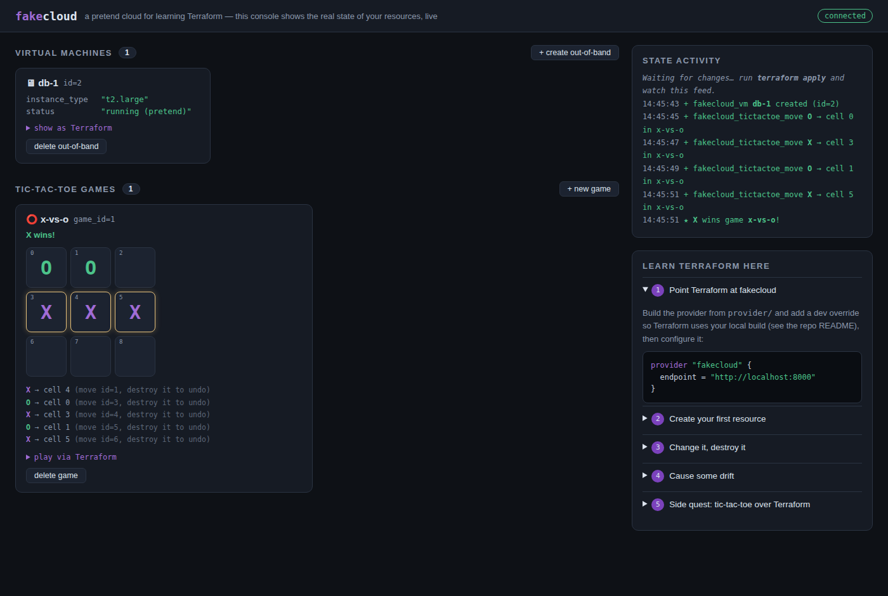

# fakecloud

A pretend cloud for **learning Terraform by watching it work**.

fakecloud is a tiny cloud provider API with a live dashboard. You manage its
resources with a real Terraform provider, and the dashboard shows every
`apply`, `destroy`, and drift event as it happens — green `+`, yellow `~`,
red `−`, just like a plan.

And because state is more fun when it's shared: tic-tac-toe moves are
Terraform resources. Point two machines at the same fakecloud and play a
friend, one `terraform apply` at a time.



## What's in the box

| Directory   | What it is |
|-------------|------------|
| `server/`   | The fakecloud API + embedded dashboard. Pure Go stdlib, in-memory state. |
| `provider/` | `terraform-provider-fakecloud`, built on terraform-plugin-framework. |
| `examples/` | Ready-to-apply configs: getting started, and the tic-tac-toe duel. |

The provider ships these types:

- `fakecloud_vm` (resource) — a pretend VM with `name` and `instance_type`
- `fakecloud_tictactoe_game` (resource + data source) — a board; computed `board`, `next_player`, `winner`
- `fakecloud_tictactoe_move` (resource) — create = play, destroy = take it back

## Quick start

**1. Run the server** (no dependencies):

```sh
cd server && go run .
```

Open <http://localhost:8000> — this is your cloud console. Keep it visible.

**2. Build the provider** and tell Terraform to use your local build via a
[dev override](https://developer.hashicorp.com/terraform/cli/config/config-file#development-overrides):

```sh
cd provider && go build -o ~/go/bin/terraform-provider-fakecloud .
```

```hcl
# ~/.terraformrc
provider_installation {
  dev_overrides {
    "pokgak/fakecloud" = "/home/YOU/go/bin"   # dir containing the binary
  }
  direct {}
}
```

**3. Apply your first resource** (skip `terraform init` — dev overrides don't need it):

```sh
cd examples/getting-started
terraform apply
```

Watch the VM card pop onto the dashboard the moment Terraform creates it.

## The learning loop

The dashboard is the point: it shows the *actual* state of the cloud, so you
can see exactly what each Terraform command does to it.

1. **Create** — `terraform apply`, watch a card appear (`+` in the feed).
2. **Change** — edit `instance_type`, apply, watch the yellow `~`.
3. **Destroy** — `terraform destroy`, watch the red `−`.
4. **Drift** — use the dashboard's *create/delete out-of-band* buttons (that's
   you clicking around the console behind Terraform's back), then run
   `terraform plan` and see how Terraform detects and proposes to fix it.
5. **Import** — every VM card shows the exact `terraform import` command to
   adopt it into your state.

## Side quest: tic-tac-toe

Moves are resources, the server is the referee, and the state file is your
scorecard.

```hcl
resource "fakecloud_tictactoe_game" "duel" {
  name = "x-vs-o"
}

resource "fakecloud_tictactoe_move" "opening" {
  game_id  = fakecloud_tictactoe_game.duel.id
  player   = "X"      # X always starts
  position = 4        # cells 0-8, row by row; 4 = center
}
```

Rules of engagement:

- Player X creates the game and shares its `id`. Player O looks it up with
  the `fakecloud_tictactoe_game` **data source** (see `examples/tictactoe/`).
- One move block per turn, then apply. Applying out of turn or onto a taken
  cell fails with the referee's reason — e.g. `Error: Move rejected — not
  X's turn, it is O's turn`. A failed apply just means "wait for your opponent".
- `terraform destroy -target` a move to take it back. Deleting the game
  clears the board for a rematch.
- The board updates live on the dashboard — and you can also click cells
  there, but that's an out-of-band change and your opponent's next plan
  will call you out on the drift. Cheat responsibly.

## API

Everything the provider does is plain JSON over HTTP, so `curl` works too:

| Method & path | Effect |
|---|---|
| `GET/POST /vms`, `GET/PUT/DELETE /vms/{id}` | VM CRUD |
| `GET/POST /tictactoe/games`, `GET/DELETE /tictactoe/games/{id}` | games (reads include derived `board`, `next_player`, `winner`, `moves`) |
| `POST /tictactoe/moves`, `GET/DELETE /tictactoe/moves/{id}` | play / inspect / undo a move |

State is in-memory: restarting the server wipes the cloud — which is itself
a decent lesson in why real state management matters.
